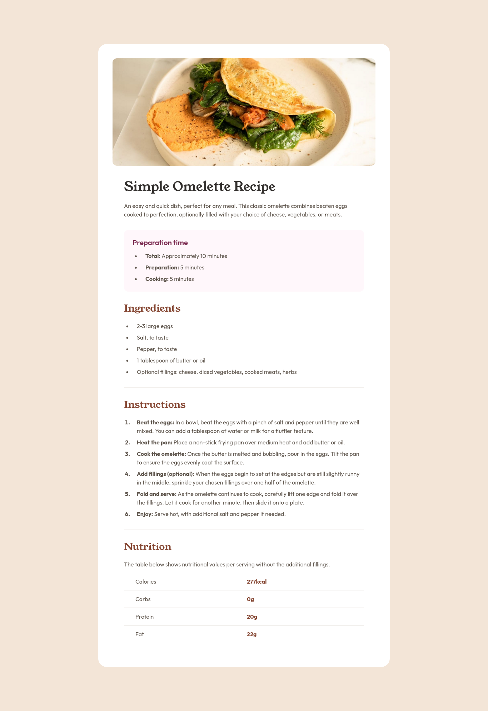
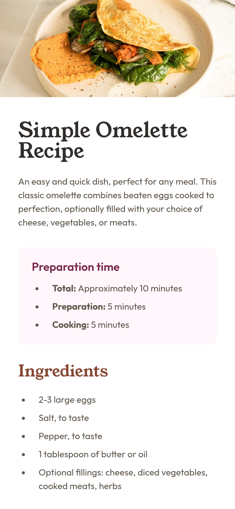

# Frontend Mentor - Recipe page

## Overview

### Screenshot

#### Desktop

#### Mobile

### Links

- Solution URL: [https://www.frontendmentor.io/solutions/responsive-recipe-page-using-css-grid-U4pEQJcyXg](https://www.frontendmentor.io/solutions/responsive-recipe-page-using-css-grid-U4pEQJcyXg)
- Live Site URL: [https://codermoshiur.github.io/recipe-page/](https://codermoshiur.github.io/recipe-page/)

## My process

### Built with

- Semantic HTML5 markup
- CSS custom properties
- CSS Grid
- Mobile-first workflow

## Author

- Website - [Moshiur](https://codersfoundation.com)
- Youtube - [@moshiur](https://www.youtube.com/moshiur)
- Facebook - [@codermoshiur](https://www.facebook.com/codermoshiur)
- Frontend Mentor - [@codermoshiur](https://www.frontendmentor.io/profile/codermoshiur)
